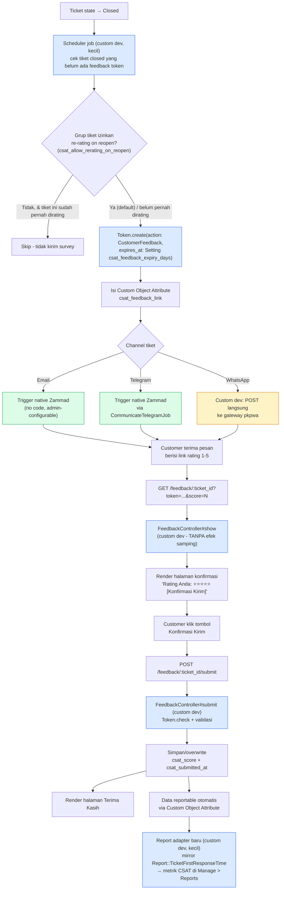

# Desain: Feedback Rating (CSAT) Native di Zammad

**Status:** Requirement baru (bukan bagian dari 18 item gap analysis awal) — saat ini Feedback Rating berasal dari integrasi sistem lain, target: jadi bagian native Zammad.
**Terkait:** Item No. 7 (Reporting) & No. 8 (Dashboard) — CSAT jadi salah satu input metrik di keduanya.

---

## 1. Ringkasan Requirement

Setelah tiket **closed**, customer perlu bisa memberi rating kepuasan (CSAT) langsung dari dalam ekosistem Zammad — tanpa bergantung pada sistem eksternal. Rating ini kemudian harus bisa dilaporkan (rata-rata/median per agent, grup, periode) di Reports & Dashboard.

## 2. Riset: Mekanisme Zammad yang Bisa Dipakai Ulang

Dicek langsung ke source `zammad-staging` — dua primitive inti Zammad sudah menyediakan hampir semua yang dibutuhkan, sehingga custom dev bisa diminimalkan:

### a. Model `Token` (`app/models/token.rb`)
Sudah dipakai Zammad untuk password reset & API token. Fitur yang relevan:
- `Token.create(action: '<nama>', user_id:, expires_at:, preferences: {...})` — generate token random aman (`SecureRandom.urlsafe_base64(48)`).
- `Token.check(action:, token:)` — validasi token, otomatis invalid kalau lewat `expires_at`.
- `preferences` (jsonb) bisa dipakai nyimpen `ticket_id` yang terkait token itu.

→ **Tidak perlu bikin mekanisme token/keamanan dari nol** — tinggal pakai `action: 'CustomerFeedback'`.

### b. `FormController` (`app/controllers/form_controller.rb`)
Ini controller publik (tanpa login) yang SUDAH ADA di Zammad inti — dipakai untuk form pembuatan tiket dari luar (`embed.js`). Pola yang relevan untuk ditiru:
- `skip_before_action :verify_csrf_token` + CORS preflight handling — pola standar Zammad untuk endpoint publik.
- Validasi token sebelum proses apapun.
- Response JSON sederhana.

→ Endpoint submit rating bisa dibuat dengan pola yang **identik**, bukan pola baru yang belum pernah diuji di codebase ini.

### c. Custom Object Attribute (Object Manager)
Sudah dipakai di beberapa gap analysis item lain (No. 1, 3, 12) — field baru di level Ticket, config murni lewat Admin UI, otomatis searchable/filterable/reportable.

### d. Trigger
Untuk kirim survey ke customer setelah tiket closed — **tidak perlu kode**, cukup kondisi `ticket.state_id is closed` + action kirim notifikasi/artikel ke customer, isi & waktu kirim diatur admin lewat UI.

### e. Channel pengiriman survey (dicek langsung ke konfigurasi Channel yang ada)

| Channel | Status di codebase | Kesimpulan |
|---|---|---|
| **Email** | Native, `Channel::Driver::...` lengkap | Trigger bisa kirim langsung, tanpa kode tambahan |
| **Telegram** | Native sepenuhnya — ada `Channel::Driver::Telegram`, `CommunicateTelegramJob` (auto-kirim artikel keluar), route & UI lengkap | Trigger bisa kirim langsung juga, tanpa kode tambahan |
| **WhatsApp** (channel "SMS" custom, adapter `sms/pkpwa`) | ⚠️ **Kode adapter tidak ditemukan** di source manapun (7.1.3 maupun backup 4.0 lama) — cuma driver SMS bawaan Zammad yang ada (`massenversand`, `message_bird`, `twilio`). Ini kemungkinan penyebab `Sms::Notification` (outbound) berstatus `active: false`. Inbound (`Sms::Account`, webhook) masih aktif. | **Temuan bug/gap terpisah** dari CSAT — kemampuan kirim WhatsApp keluar dari Zammad kemungkinan hilang sejak upgrade versi. Untuk CSAT, kita bypass: kirim langsung via HTTP POST ke gateway (`http://8.215.68.231:1000/wa/send`, sudah ada di `Channel#options`), tidak lewat framework Channel Zammad yang hilang itu. Detail format payload dikoordinasikan dengan tim yang maintain gateway. |

---

## 3. Arsitektur yang Diusulkan

**Legend:** 🟦 Biru = custom dev · 🟩 Hijau = native Zammad, tanpa kode · 🟨 Kuning = custom dev yang bergantung pada koordinasi tim eksternal (gateway WhatsApp)

### Custom Object Attribute yang dibutuhkan (Object Manager, no-code)

**Level Ticket:**
| Field | Tipe | Catatan |
|---|---|---|
| `csat_score` | Integer/Select (1-5) | Skor rating, bisa di-overwrite selama token belum expired |
| `csat_submitted_at` | Datetime | Kapan customer terakhir submit |
| `csat_feedback_link` | Text (internal-only, hidden dari customer) | URL bertoken, diisi scheduler |
| `csat_email_sent_at` | Datetime | Penanda supaya survey tidak terkirim dobel; direset saat tiket reopen→closed lagi (jika grup mengizinkan re-rating) |

**Level Group (baru — ini yang menjawab kebutuhan "beda departemen beda aturan"):**
| Field | Tipe | Default | Catatan |
|---|---|---|---|
| `csat_allow_rerating_on_reopen` | Boolean | `true` | Kalau `false` (misal grup Payroll), tiket yang sudah pernah dirating tidak akan dikirimi survey lagi walau reopen→closed berkali-kali |

### Setting baru (Admin > Settings, no-code, bisa diubah tanpa redeploy)
| Key | Default | Catatan |
|---|---|---|
| `csat_feedback_expiry_days` | `7` | Masa berlaku link rating sejak dikirim |

### Endpoint publik baru (custom dev)
- `GET /feedback/:ticket_id?token=...&score=N` — tampilkan halaman konfirmasi berisi skor yang dipilih + 1 tombol. **Tidak menyimpan apapun** (menghindari auto-fetch link preview WhatsApp/Telegram & email security scanner yang bisa submit skor palsu).
- `POST /feedback/:ticket_id/submit` — baru di sini skor benar-benar disimpan, dipicu klik tombol konfirmasi (aksi eksplisit manusia).

## 4. Pembagian Effort

| Bagian | Jenis | Effort |
|---|---|---|
| Custom Object Attribute Ticket (4 field) + Group (1 field) | Konfigurasi (Object Manager) | Kecil |
| Setting `csat_feedback_expiry_days` | Konfigurasi (Admin UI) | Kecil |
| Trigger kirim survey (Email & Telegram) | Konfigurasi (Admin UI) | Kecil |
| Scheduler job generate token + isi link + cek aturan re-rating per Group | **Custom dev** | Kecil-Medium (~1 file, mirip pola Scheduler yang sudah ada di codebase) |
| Kirim WhatsApp langsung ke gateway pkpwa | **Custom dev** | Kecil-Medium (perlu koordinasi format payload dgn tim gateway) |
| `FeedbackController` (`show` = halaman konfirmasi, `submit` = simpan skor) + route publik | **Custom dev** | Medium (meniru `FormController`, dipisah 2 aksi sesuai desain anti-abuse) |
| Report adapter CSAT Average/Median | **Custom dev** | Kecil (mirror `Report::TicketFirstResponseTime` yang sudah ada) |
| Halaman konfirmasi + "Terima kasih" publik | Frontend sederhana (HTML statis/ERB) | Kecil |

**Total: didominasi konfigurasi + beberapa file custom dev kecil-menengah** — jauh lebih ringan dibanding perkiraan awal karena bisa menumpang pada `Token` model, pola `FormController`, dan channel Telegram yang semuanya sudah teruji di codebase ini.

## 5. Keputusan Desain (Sudah Difinalisasi)

| # | Keputusan | Pilihan Final |
|---|---|---|
| 1 | Token single-use vs re-submit | **Overwrite** — skor boleh diganti selama token belum expired |
| 2 | Expiry window | **Configurable** via Setting `csat_feedback_expiry_days`, default **7 hari** |
| 3 | Tiket reopen setelah rating | **Configurable per Group** via Custom Object Attribute `csat_allow_rerating_on_reopen`, default **`true`** (boleh rating ulang); grup tertentu (mis. Payroll) bisa di-set `false` |
| 4 | Channel pengiriman | **Multi-channel**: Email & Telegram via Trigger native; WhatsApp via kirim langsung ke gateway (custom dev kecil) |
| 5 | Anti-abuse link one-click | **GET tanpa efek samping** (cuma render halaman konfirmasi) + **POST eksplisit** untuk benar-benar simpan skor — menghindari auto-fetch oleh link-preview WhatsApp/Telegram & email security scanner |

## 6. Langkah Berikutnya

1. Buat branch `feature/csat-native`.
2. Urutan build: Custom Object Attribute (Ticket + Group) → Setting expiry → Scheduler job token → `FeedbackController` (show + submit) → Trigger Email/Telegram → kirim WhatsApp → Report adapter.
3. Koordinasi dengan tim yang maintain gateway WhatsApp (`http://8.215.68.231:1000/wa/send`) untuk format payload yang benar.
4. Uji end-to-end di staging sebelum dianggap selesai — termasuk simulasi reopen tiket di grup dengan `csat_allow_rerating_on_reopen = false`.
